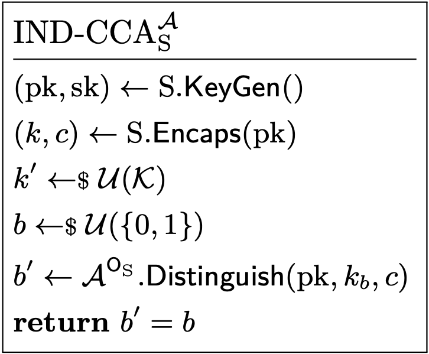
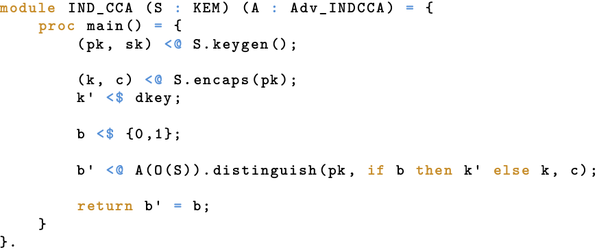
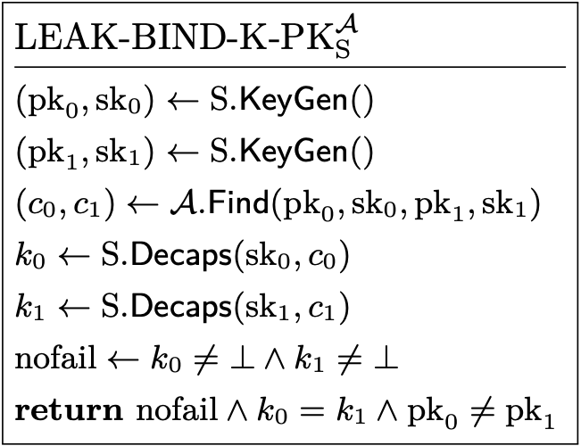
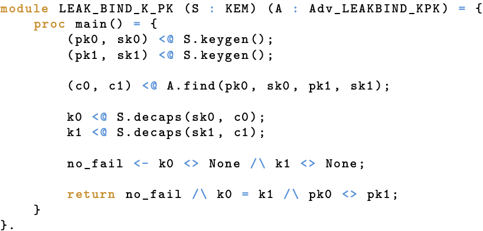
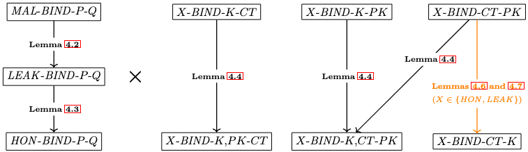
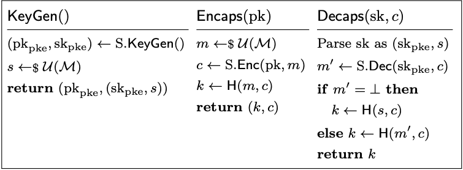
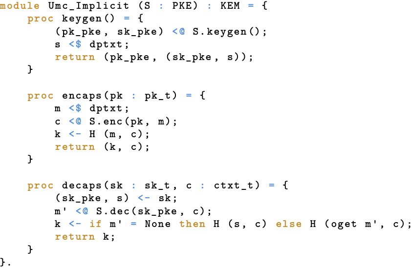

# Keeping up with the KEMs, Formally (EasyCrypt Edition)

This post describes our project about the formalization and formal verification of binding properties for KEMs in EasyCrypt. In doing so, it tries to assume as little prior knowledge as possible and explain much of the material from the ground up in an intuitive way.

By Matthias Meijers

##

To enable secure and efficient communication with nearly anyone at any time, the cryptography running on our devices makes heavy use of the ability to establish short shared secrets over insecure channels and networks. For a while now, such secret establishment has, among others, been achieved by means of so-called key encapsulation mechanisms, or KEMs for short. Intuitively, a KEM allows someone, say Alice, to locally generate a short secret and then securely share it over an insecure channel with someone else, say Bob. Naturally, if this is to be of any value, Bob should be the only one that is able to obtain the secret; particularly, any malintended eavesdroppers on the insecure channel should be left in the dark as far as the secret is concerned.

If you know a thing or two about cryptography, you might have guessed that *asymmetric cryptography* (or *public-key cryptography*) is at the heart of this: Alice can only create and securely share a secret with Bob if she knows Bob's *public* key, for which only he knows the corresponding *private* or *secret* key. Certainly, this private key is precisely what makes it so that Bob can extract any secret created using his public key, while no one else can (assuming he has been handling his private key extremely carefully, of course).

From this brief description and a tiny bit of imagination, we can already come up with the pieces that make up a KEM: key generation, for the generation of an asymmetric key pair consisting of a public key and a private key; encapsulation, for the creation of a short secret–commonly referred to as *shared secret,* *shared key,* or simply *key*–and a corresponding value–called an *encapsulation* or *ciphertext*–that can securely be shared over untrusted channels; and decapsulation, for the extraction of a short secret from an encapsulation. Now, if you have heard of public-key encryption (PKE) schemes before, you might have noticed that all of this looks a lot like what an analogous description of a PKE scheme would look like. In fact, it seems like, if we were to start from a PKE scheme, we could simply choose a short secret as our message and use its encryption as encapsulation to obtain a KEM (where PKE scheme's decryption serves to extract the secrets, of course). And while you should be a bit careful, this intuition is definitely not misplaced: there are several transformations, such as the Fujisaki-Okamoto (FO) transform, that construct a (secure) KEM from a (secure) PKE scheme by doing something similar. What's more, you can also go the other way around, starting with a (secure) KEM and ending up with a (secure) PKE scheme. Nevertheless, despite these striking similarities and connections with PKE schemes, KEMs are considered a separate type of cryptographic construction, and are also analyzed as such.

In the past handful of years, KEMs have become of particular interest due to their role in moving to a post-quantum cryptographic era. Namely, cryptographically relevant quantum computers threaten nearly all of the currently deployed asymmetric cryptography, including most operational PKE schemes and KEMs. Although not everyone agrees when such computers will actually become operational, all hope of a secure Internet is lost once they do, at least with contemporary (asymmetric) cryptography. Moreover, constructing, analyzing, standardizing, and deploying novel cryptography is an extremely time-consuming process, which means that moving timely is of utmost importance. For this reason, government institutions and standard bodies all around the world have been searching for quantum-secure alternatives for our (asymmetric) cryptography. Somewhat recently, the National Institute of Standards and Technology (NIST) has officially standardized ML-KEM with the release of [FIPS 203](https://doi.org/10.6028/NIST.FIPS.203). As its name suggests, ML-KEM is a KEM; however, as opposed to most currently deployed KEMs, ML-KEM is widely believed to be resistant against attacks by quantum computers. (Naturally, it is also believed to be resistant against attacks by classical computers.) Although the official standard has only just been released, the commitment to the standardization of ML-KEM has already been out for quite a while. As a result, the deployment of ML-KEM has already been in the works by many teams working on popular products that use KEMs under the hood. In fact, some products already include working implementations by now. For example, [Google Chrome](https://security.googleblog.com/2024/09/a-new-path-for-kyber-on-web.html), [Mozilla Firefox](https://www.mozilla.org/en-US/firefox/132.0/releasenotes/), and [Cloudflare](https://pq.cloudflareresearch.com/) all provide support for ML-KEM, meaning you might be using post-quantum cryptography right now while reading this blog post. Cool!

At this point, you might be wondering why ML-KEM, or any cryptographic construction for that matter, is believed to be secure, and what "secure" even means. Well, with the dawn of "modern cryptography" (around 1980), the common answer to this question has shifted from something like "If *we* cannot find a way to break it, it must be secure" to something based on formal definitions, precise assumptions, and rigorous mathematical proofs. Ever since this shift, we have never looked back.

Alright, this is still very abstract, so let's make it a bit more concrete by walking through (the creation of) a typical security definition for KEMs. First and foremost, this definition should somehow be such that, if a KEM satisfies it, we can be confident that we can securely use it as intended. As we have seen, for a KEM, "securely use it as intended" means that if Alice runs the KEM's encapsulation procedure with Bob's public key (that Bob obtained by running the KEM's key generation procedure), sends the resulting encapsulation over to Bob (but keeps the secret to herself), and Bob runs the KEM's decapsulation procedure with his private key and the encapsulation (also keeping the resulting secret to himself), then both Alice and Bob can be sure that *no one else has any significant information* on their shared secret.[^1] Okay, we are making progress, but this is still quite vague: how would we even begin to capture something like "*anyone* but Alice and Bob has *no* significant information on the shared secret". Dissecting this statement, we can discern two main parts: "anyone" and "no significant information". Typically, we model "anyone" by considering an arbitrary algorithm as our attacker. Here, "arbitrary" implies that we do not assume anything about the algorithm's operations or strategy, it truly could be anyone\! Now, suppose such an attacker obtains all public information related to a KEM interaction, i.e., a public key and an encapsulation created with that public key. Then, one way to model that the attacker obtains "no significant information" about the secret underlying the encapsulation is by giving it either (1) a random value or (2) the actual secret–each with the same probability–and asking it to determine which is the case. Surely, a random value carries no information whatsoever about anything, let alone about the actual secret underlying the encapsulation. Intuitively, then, if the attacker cannot meaningfully distinguish between receiving a random value or the actual secret *when it knows the corresponding encapsulation (and public key)*, it cannot obtain any "significant information" about the secret from the public information. Finally, augmenting this scenario by giving the adversary the power to request decapsulations of its choice,[^2] we end up with the *de facto* security definition for KEMs: INDistinguishability under Chosen-Ciphertext Attacks (IND-CCA). Again, if you have already seen PKE schemes before, several bells might be ringing right now, and justifiably so: IND-CCA for KEMs is analogous to (and derived from) the similarly named property for PKE schemes.

The IND-CCA property already covers a lot of ground: If we use a KEM that satisfies it, we can be confident that *no one* can obtain any meaningful information about our shared secrets, *except* for the people that we actually intend to share them with (assuming nobody does something silly like exposing their private keys). What more could we possibly want? Unfortunately, as it turns out, IND-CCA is no panacea. The main reason for this is that the IND-CCA definition considers a rather narrow situation; indeed, if you think about it, IND-CCA essentially only covers a single, isolated, honest (i.e., as specified) execution of the considered KEM. Don't get me wrong, it is still an extremely strong (and crucial) security property, and definitely a good default one. However, in practice, we tend to use KEMs in much larger contexts, e.g., protocols involving a sequence of messages, potentially between more than just two parties, and several different cryptographic tools. Even worse, in the real world, protocol executions may not be isolated, i.e., you can start a protocol run with Alice and Bob simultaneously and nothing may prevent you from using the values from the run with Alice in the run with Bob. Evidently, these are much more convoluted scenarios than the crisp, isolated scenario considered by IND-CCA; and, unsurprisingly, they open up angles of attack not covered by IND-CCA. One example of this concerns a scenario where an attacker gets an encapsulation from Alice, extracts the secret, and manages to create another *valid* encapsulation for Bob that gives him the same secret upon decapsulation. Depending on the protocol, the ramifications of this attack may differ, but the point is that nothing about IND-CCA precludes this type of attack\! In other words, the employed KEM could undoubtedly satisfy IND-CCA, and this attack would still be possible. This is where binding properties come in.

Binding properties are a relatively new kid on the block when it comes to KEM security. As exemplified above, their main purpose is to prevent attacks that may occur whenever KEMs are used in larger protocols, and specifically those where an attacker attempts to manipulate KEM executions/interactions by cooking up and injecting values (e.g., encapsulations) without the honest parties involved realizing. In other words, the binding properties determine to what extent certain artifacts in a KEM execution determine others: surely, if artifact X determines Y, it should not be possible to inject some cooked up value for Y other than that determined by the value of X. As we will see soon, binding properties come in a lot of variants, each considering different binding artifacts (i.e., which artifacts to consider for X and Y) and/or attacker capabilities. Some of these properties actually coincide ("are equivalent to") other properties that have been around for longer: *robustness* and *collision-freeness*. As IND-CCA, these KEM properties are analogous to (and derived from) from the identically named properties for PKE schemes. Nevertheless, robustness and collision-freeness still fail to cover certain types of binding-esque attacks on protocols. In an attempt to fix this, Cremers, Dax, and Medinger introduced an entire hierarchy of binding properties [in a recent paper called Keeping Up with the KEMs](https://eprint.iacr.org/2023/1933), covering nearly any binding-related attack scenario you can think of. Additionally, they provided some high-level analyses of Kyber (the pre-standard, but way cooler, name for ML-KEM) and some other popular KEMs with respect to their new properties; part of the analysis for Kyber/ML-KEM was later [corrected and extended by Schmieg](https://eprint.iacr.org/2024/523). Some of these properties have a proven link to [attacks](https://cryspen.com/post/pqxdh/), and some do not, but we consider them all out of completeness, given that the community does not fully agree today on which are important for actual security and which are not.

Okay, so now we have a better idea of what a security definition looks like, how do we actually prove that a construction is secure with respect to such a definition? Why, with a proof, of course\! Now, to be completely transparent, we typically *do not* prove absolute, unconditional security. Instead, nearly all security proofs are relative to, or conditioned on, one or more *assumptions*, commonly about the infeasibility of breaking another construction or solving some hard problem. (Recall that one of the main aspects of modern cryptography we mentioned earlier concerns *precise assumptions*; this is where they come in\!) For example, ML-KEM is proven to be IND-CCA secure *assuming* the "hardness" of solving a particular mathematical problem about lattices. Where does this relation come from? From the way ML-KEM operates. That is, ML-KEM is designed such that, from a mathematical perspective, it essentially operates on lattices in a way that "introduces" the hard problem. A proof for its IND-CCA security then effectively shows that *if* an attacker would be able to break the IND-CCA security of ML-KEM, *then* we could use this attacker to solve the underlying lattice problem. Since we believe such lattice problems are infeasible to solve, we must also believe that such an attacker does not exist. Pretty simple, right?

If you have ever tried to wrap your head around a cryptographic security proof, you might already be aware that they can get pretty hairy pretty fast. To make matters worse, the authors are oftentimes rather hand-wavy in their explanation (not necessarily by choice, sometimes aspects like page limits are also part of the reason), further increasing the difficulty of comprehending the proof. Wouldn't it be amazing if we could, say, let a computer verify the proof? Well, good news, we can! (If you are an avid reader of this blog, [you might already know](https://cryptographycaffe.sandboxaq.com/posts/formal-verification-overview/).) Building tools for the verification of cryptography is a main objective of the field of computer-aided cryptography. In recent times, this field has advanced a lot, leading to the development of a plethora of tools able to handle increasingly important use cases. For instance, [EasyCrypt](https://www.easycrypt.info/) has been used to verify the security of [XMSS](https://eprint.iacr.org/2023/408) and [SPHINCS+](https://eprint.iacr.org/2024/910), two standardized post-quantum digital signature schemes. Additionally, in combination with [Jasmin](https://github.com/jasmin-lang/jasmin), EasyCrypt has been used to [verify the (IND-CCA) security of ML-KEM, as well as the correctness and security of a corresponding implementation](https://eprint.iacr.org/2024/843). For another tool, [Tamarin](https://tamarin-prover.com/) has been used to verify the design of both [TLS 1.3](https://doi.org/10.1145/3133956.3134063) and the [5G AKA protocol](https://arxiv.org/abs/1806.10360). Other examples include the verification of [(a variant of) the Signal protocol](https://doi.org/10.1109/EuroSP.2017.38) using [ProVerif](https://bblanche.gitlabpages.inria.fr/proverif/) and [CryptoVerif](https://bblanche.gitlabpages.inria.fr/cryptoverif/), and [Hybrid Public-key Encryption (HPKE)](https://eprint.iacr.org/2020/243) using CryptoVerif. A more systematic overview of computer-aided cryptography is provided by Barbosa, Barthe, Bhargavan, Blanchet, Cremers, Liao, and Parno in [their systematization of knowledge](https://eprint.iacr.org/2019/1393).

So far we have covered a wide range of cryptographic topics on a relatively high level. While extremely interesting (we think, at least\!), the material we discussed hitherto is old stuff, and mainly serves as the preamble to what is about to come. That is, we now proceed to the meat of this post, which builds on everything we have seen thus far, but is actually something new (and still interesting, we promise\!). What did we do, you ask? In short, we took it upon ourselves to bring binding properties to the wonderful land of formal verification, and specifically to EasyCrypt, which is a tool aimed at the formal verification of security proofs of the form discussed before. More precisely, we essentially did three things: (1) construct libraries for PKE schemes and KEMs, including the verification of some generic relations between properties; (2) verify binding properties of parts of the FO transform; and (3) verify that (the particular version of the FO transform used by) ML-KEM possesses some important binding properties. Anyone with some formal verification experience would probably look at this and think that it looks like a lot of work; and it is, but we like to be ambitious. At the time of writing, (1) is fully finished, but (2) and (3) remain works in progress. That said, we should highlight that (2) and (3) consist of a lot of standalone proofs and results, each of which has merit on its own. So, while (2) and (3) are still works in progress in the sense that we didn't achieve *all* of these standalone results, we did achieve several by now. In the remainder, we will go over these different parts in a bit more detail.

[^1]: At first glance, you may think that "no one but Alice and Bob knows the secret" would be a more natural and intuitive security condition. However, this condition would not exclude cases like an attacker narrowing down the set of possible secrets to two options, at which point you might as well share the secret directly with the attacker.

[^2]: Although it may seem unrealistic and overly conservative to give the attacker this power, certain real-world scenarios actually allow for similar or related capabilities. Naturally, though, we do not allow the attacker to request the decapsulation of the encapsulation it is "challenged" on, as this would make the attack trivial.

## Libraries

One of the selling points for using tools such as EasyCrypt in the verification of cryptography is that it effectively reduces the human verification efforts down to checking the specification and statements coded up in the tool. Indeed, if we trust the tool to do its job properly, any proof should be verified for us. Thus, as long as the specification and statements correctly capture the considered construction and (what we mean by) its security, we should be good to go.	 Nevertheless, since computers don't mesh as well with imprecision as humans do, the specification and statements might still become quite extensive, especially for more complex schemes. Therefore, we would ideally also try to offload writing these as much as possible, reducing the manual verification effort even further. Fortunately, EasyCrypt provides some modularity features, particularly allowing us to *generically* define constructions (e.g., KEMs) and the corresponding security properties (e.g. IND-CCA); afterward, we can instantiate these and use them whenever we are doing a proof for a *specific* scheme (e.g., ML-KEM). Further, any result that holds generically may directly be verified using the generic definitions. Instantiation then also immediately gives you all of these results in your specific context. It goes without saying, then, that the creation of *libraries*–i.e., files containing these generic definitions and results–greatly facilitates reducing *both* the specification effort (since we can use the definitions and relations from the library instead of creating these ourselves) as well as the manual verification effort (since we only need to agree on a particular definition in the libraries *once and for all*, instead of needing to agree on a definition for *each specification/proof*).

By itself, EasyCrypt already comes with numerous libraries, many of which concern cryptographic constructions or arguments. Before we started this project, though, there was no such library for KEMs, and only an extremely minimal one for PKE schemes. Although we initially only set out to analyze the binding properties of certain KEMs and their underlying constructions, we seized the opportunity to further facilitate future EasyCrypt endeavors by also constructing comprehensive libraries for KEMs and PKE schemes.[^3] To this end, we scoured the literature searching for relevant security properties, and formalized them. (After formalizing what it means to be a KEM or PKE scheme, of course.) In the end, we coded up a total of 70+ "unique" properties.[^4] For the more experienced theoretical cryptographers: this includes one-wayness, indistinguishability, (strong) non-malleability, (strong/weak) robustness, (strong/weak) collision-freeness, (strong/weak) anonymity, and binding properties, each under multiple adversarial models. For PKE schemes specifically, we also included several properties for imperfectly correct schemes, as considered by (variations of) the FO transform. Lastly, to make everything complete, we took the liberty of formalizing each property in the Random Oracle Model (ROM)–a model providing cryptographers with the cheat code of replacing one or more ordinary functions by completely random functions, simplifying security proofs.

After all this prose about formalizing stuff, you might be wondering what that actually looks like. Let's look at an example! Since we have already seen the intuition behind the IND-CCA property for KEMs, let's look at that. First and foremost, we use well-defined programs (i.e., code) as our means of formalization, even on paper. This shouldn't seem that farfetched given all the talk about algorithms. Apart from being an intuitive approach in and of itself, it is also the one used by EasyCrypt, so this meshes well. Now, before doing anything else, we should probably formalize the object we are talking about: a KEM. Well, on paper, we would say something along the lines of "A KEM is a triple of algorithms ($\mathsf{KeyGen}$, $\mathsf{Encaps}$, $\mathsf{Decaps}$) such that (1) $\mathsf{KeyGen}$ takes no input, and outputs a public and private key; (2) $\mathsf{Encaps}$ takes a public key as input, and outputs a secret and an encapsulation; and (3) $\mathsf{Decaps}$ takes a private key and an encapsulation as input, and outputs a secret or an explicit indication of failure", where public key, private key, secret and encapsulation are all elements from their respective domains. Typically, this is accompanied by a statement specifying what it means for a KEM to function properly (i.e., correctness). Depending on the paper or book you are reading, there might even be a statement like "$\mathsf{KeyGen}$ and $\mathsf{Encaps}$ are probabilistic, but $\mathsf{Decaps}$ is deterministic". Nevertheless, the core of the formalization is not much more than the specification of an interface. In EasyCrypt, we formalize such an interface using what is called a module type, which is comparable to a dumbed-down interface from your favorite object-oriented programming language, only allowing signatures of procedures. The one we use to formalize KEMs is given below.

 formalization.")

*EasyCrypt: KEM (interface) formalization.*

Here, `proc encaps(pk : pk_t) : key_t * ctxt_t` denotes a procedure named "encaps" that takes a value of type `pk_t` as input and outputs a value of type `key_t` and a value of type `ctxt_t` as a pair. Given that `pk_t`, `key_t`, and `ctxt_t` respectively formalize the domains of public keys, keys (secrets), and ciphertexts (encapsulations),[^5] this directly corresponds to $\mathsf{Encaps}$. Similarly for the other procedures. Not too bad, eh? (If you are wondering about the `option` in the output type of `decaps`: this defines that `decaps` can also output the special value `None`, which we use to explicitly indicate failures.)

Alright, now we have formalized what a KEM is, how do we use this to formalize the IND-CCA property? Using our paper definition of a KEM, we can rephrase the sequence of actions performed in IND-CCA as follows: (1) generate a keypair with $\mathsf{KeyGen}$; (2) create a secret and an encapsulation with $\mathsf{Encaps}$, using the public key obtained from $\mathsf{KeyGen}$; (3) sample an independent secret uniformly at random; (4) flip a coin; (5) if the coin landed on tails, give the attacker the encapsulation with the actual secret, otherwise give the attacker the encapsulation with the independently sampled secret; and (6) ask the attacker to determine whether it was given the actual secret or the sampled one, i.e., whether the coin landed on tails or on heads, while allowing it to request decapsulations of its choice. We say the attacker wins if it guesses correctly. (We then consider the KEM to have the IND-CCA property–or, as it is more commonly stated, to be IND-CCA secure–if the probability of the attacker winning is "small", for some suitable definition for "small".) Surely, putting it like this, a programmatic formalization doesn't seem too far-fetched. Indeed, your typical paper formalization of IND-CCA, given below, essentially translates each numbered step above into a single program statement. The only exception to this is that steps (5) and (6) are combined in a single call to the attacker algorithm, where the capability to request decapsulations is modeled via access to a so-called oracle. An oracle is essentially just a procedure that the attacker gets black-box access to: in this case, the procedure takes an encapsulation, decapsulates it with the considered secret key (provided it is not the encapsulation the attacker is "challenged on"), and returns the result. For brevity's sake, we don't explicitly show the formalization of the oracle, but it really is as straightforward as you would expect. Concerning notation, we use $\mathcal{A}^{\mathsf{O}_{\mathrm{S}}}$ for the attacker algorithm $\mathcal{A}$ with access to oracle $\mathsf{O}_{\mathrm{S}}$, $\leftarrow$ for regular assignments and procedure calls (or sampling operations when followed by a small "\$"), $\mathcal{U}(X)$ for the uniform distribution over set $X$, and $\mathcal{K}$ for the set of shared secrets. Also, "flipping a coin" is formalized as "sampling a bit uniformly at random", as is usual.

*Paper: Formalization of IND-CCA.*

The corresponding EasyCrypt formalization, stripped of some less informative things like variable declarations, is shown below. If you take it from us that `<-` stands for regular assignment, `<@` stands for calling a procedure, `<$` stands for sampling, `dkey` stands for the uniform distribution over `key_t`, `{0,1}` stands for the uniform distribution over single bit values, and we didn't mess up the oracles, the formalization is essentially a line-by-line translation of the paper version. Neat, no?

*EasyCrypt: Formalization of IND-CCA.*

[^3]: You might wonder why we include PKE schemes when we are seemingly only interested in KEMs. The reason for this is that the KEMs we are mostly interested in are built using (a variant of) the FO transform, which starts from a PKE scheme.

[^4]: The exact number depends on your definition of unique.

[^5]: While we have mostly been using the terms "(shared) secret" and "encapsulation", people often refer to these as "(shared) key" and "ciphertext", hence the type names `key_t` and `ctxt_t`.

## Binding Hierarchy

In their paper introducing binding properties, Cremers et al. describe these properties as capturing the sense in which certain KEM outputs uniquely determine others. Alternatively stated, *binding properties capture in what way(s) a KEM, if it does not explicitly tell you something is wrong, guarantees that the values you have seen and used actually belong together (meaning that an attacker cannot have injected different ones without the KEM failing and, hence, you noticing).* Here, the kind (and extent) of guarantees depends on the particular binding property considered, and there are quite some. Specifically, Cremers et al. differentiate variants across two dimensions: binding elements and adversarial capabilities. For the former, they consider the public key, shared secret, and encapsulation as potential binding elements; the secret key is left out so that the binding properties provide guarantees for both the sender and receiver in a KEM interaction. Each binding property has at least one "binding source" and one "binding target", but all have to be binding elements. A binding property with binding source(s) P and binding target(s) Q captures the binding of Q by P. That is, if a KEM satisfies this property, then values of P determine values of Q; put differently, if the KEM doesn't explicitly fail, you can be confident that the values of Q are the ones that belong to the values of P. Note that, since a public key is meant to be used for the creation of many secret/encapsulation pairs–all of which should be different for basic security guarantees–it does not make much sense to have the public key as a sole binding source. Moreover, it also does not make much sense to allow for overlapping elements between P and Q: an element always binds itself. Therefore, such properties are excluded. In terms of adversarial capabilities, Cremers et al. define the honest (HON), leaking (LEAK), and malicious (MAL) model as follows. First, in HON, the attacker has similar capabilities as in IND-CCA, i.e., access to all public keys as well as decapsulations of its choice. Second, in LEAK, the attacker gets access to all public information as well as the considered secret keys. Finally, in MAL, the attacker gets to choose the considered (secret and public) keys itself. Tying everything together, we get binding properties of the form X-Bind-P-Q, where X is either HON, LEAK, or MAL; P is either K, CT, {K, CT}, {K, PK} or {CT, PK}; and Q is either K, CT, PK.[^6] Tallying everything up, this gives us 3 * 7 binding properties to consider. (As mentioned earlier, we do not consider properties with overlapping elements between P and Q.)

Although the above overview and intuitions are nice, we cannot do anything proper without some formality. Since many of the binding properties are rather similar, Cremers et al. refrain from formalizing each binding property individually, and instead formalize more generic properties that capture a bunch of individual properties at once. While we also follow this approach in EasyCrypt, we will only consider specific, individual properties in this blog to prevent any unnecessary complexity (it is all equivalent in the end). Having said that, let's formalize LEAK-BIND-K-PK, taking the same approach as we did for IND-CCA. Starting off, a sequence of actions that describes LEAK-BIND-K-PK is the following: (1) generate two keypairs with $\mathsf{KeyGen}$; (2) give the attacker both key pairs and ask it to provide two encapsulations; and (3) decapsulate the first (resp. second) encapsulation with the secret key from the first (resp. second) keypair. The attacker wins if the decapsulations succeed, the resulting shared secrets are the same, and the public keys are different. Admittedly, in this case, the last condition is a bit funny as it solely relies on the KEM and *is not* influenced by the attacker; yet, this is not a problem since it should be (extremely likely to be) true for any KEM satisfying minimal security guarantees. We elaborate on this a bit more below. More importantly, remark that the adversary has indeed broken LEAK-BIND-K-CT if it wins. Namely, if the attacker wins, it managed to cook up encapsulations for which the decapsulations *did not* fail and resulted in a single value for the binding sources (i.e., shared secret) with multiple values for the binding targets (i.e., public keys). The paper formalization of this property is as follows.

*Paper: Formalization of LEAK-BIND-K-PK.*

As with IND-CCA, the EasyCrypt formalization is an intuitive line-by-line translation of the paper formalization. This formalization is given below, again stripped of the non-informative bits.

*EasyCrypt: Formalization of LEAK-BIND-K-PK.*

With the landscape of binding properties laid out, the hierarchy is actually fairly easy to add on top. Conceptually, the hierarchy is a combination of two sub-hierarchies. The first sub-hierarchy concerns adversarial capabilities, ranking the properties from strong to weak. That is, it states that a property implies another if it provides the attacker with more power, all else equal. For example, this means that a KEM satisfying MAL-BIND-P-Q also satisfies the LEAK and HON versions of this property. Think about it, if a KEM can guarantee some binding property while fending off an extremely powerful attacker, it can also do so while fending off a less powerful attacker! The second sub-hierarchy concerns the considered binding elements. Here, an initial observation shows that properties with multiple binding *sources* are implied by those with a subset of these sources, all else equal. For instance, this means that a KEM satisfying X-BIND-K-PK also satisfies X-BIND-K,CT-PK. Again, think about it, if a single binding source is already sufficient to bind some target, adding another source doesn't change that fact and is actually useless! Lastly, the second sub-hierarchy describes an implication that, technically, is not completely generic; at least not as generic as the other results. Specifically, it states that in the HON and LEAK cases, the ciphertext (i.e., encapsulation) binds the key (i.e., shared secret) if it binds the public key. That is, if a KEM satisfies X-BIND-CT-PK, then it also satisfies X-BIND-CT-K, for X either HON or BIND. The reason this result is not as generic as the others is that it requires that generating the *same* public key (by two independent calls to $\mathsf{KeyGen}$) is unlikely, which *technically* does not follow from the definition of a KEM. Nevertheless, this is such a basic requirement for a KEM (also implied by, e.g., IND-CCA and even weaker properties) that the result is still added to the hierarchy. We want to emphasize, though, that this is a typical example of an implicit assumption made in pen-and-paper expositions of cryptography that has to be dealt with explicitly in formal verification. While this one is unproblematic, these kinds of seemingly innocuous assumptions can actually turn out to be rather non-trivial and not (as easily) applicable as initially thought, potentially leading to unnoticed errors. Having to deal with them explicitly, as you have to in formal verification, fixes this (although it can definitely be annoying!). Anyhow, going back to the last piece of the hierarchy, the intuition is as follows and goes via contraposition. Suppose a KEM doesn't satisfy LEAK-BIND-CT-K; this means that there exists an attacker that is able to cook up an encapsulation such that it successfully decapsulates under the considered secret keys. (Actually, it means more, but this is the relevant part here.) Certainly, if the public keys are different (by above assumption), the exact same encapsulation also breaks LEAK-BIND-CT-PK. That's it. Pictorially, the hierarchy can be summarized as follows. This figure is directly taken from the original [Keeping up with the KEMs paper](https://eprint.iacr.org/2023/1933), and so all lemma references concern that paper.

*Hierarchy of binding properties.*

Although this (already very long) blog post is too short to also dive into the specifics of proving and formally verifying in EasyCrypt, we hope you believe us when we say we did so for the entire hierarchy–in fact, also for a bunch of other hierarchical (non-binding) relations–appending the proofs to the library. If you don't believe us, you can see it for yourself at [https://github.com/EasyCrypt/easycrypt](https://github.com/EasyCrypt/easycrypt), where the libraries have been included in the official tool. Particularly, take a look at the `KeyEncapsulationMechanisms.eca`, `KeyEncapsulationMechanismsROM.eca`, `PublicKeyEncryption.eca`, and `PublicKeyEncryptionROM.eca` files in the `theories/crypto/` directory.

[^6]: Although it would make sense to consider combinations of binding targets, we do not do so as such binding properties can always be deconstructed into a conjunction of the versions with only a single target.

## Fujisaki-Okamoto Transform

With the KEM and PKE libraries at our service, we were ready to combine their strengths and tackle some serious problems, starting with the FO transform–or, rather, [a revised, modular version of it that also enjoys security against quantum attackers](https://eprint.iacr.org/2017/604). Ever since its publication, this modular revision has received a significant amount of attention due to its potential in constructing post-quantum KEMs. In fact, to date, nearly all post-quantum KEMs that have seriously been considered for standardization make use of (a variant of) this transform, including the already standardized ML-KEM. As such, analyzing this transform, establishing its properties, and verifying the corresponding claims is of great importance, in turn making it a great target for formal verification. Throughout the remainder, we will simply say "FO" instead of "modular revision of FO" for brevity's sake.

With the FO transform, we are not really dealing with a single transform, but four. All of these take a PKE scheme and turn it into a KEM, but each does it in a slightly different way, accordingly giving slightly different properties. Diving a bit deeper, there is a single "base" transform, called the T transform, that turns a PKE scheme into its *derandomized* sibling and, further, adds a *re-encryption* step to decryption. What does that mean? Well, a PKE scheme is typically defined as a triple of algorithms ($\mathsf{KeyGen}$, $\mathsf{Enc}$, $\mathsf{Dec}$), where both key generation ($\mathsf{KeyGen}$) and encryption ($\mathsf{Enc}$) can be probabilistic. Probabilistic encryption is needed to achieve the security properties we typically expect a PKE scheme to have (among which IND-CCA, the PKE version). Now, the T transform takes such a PKE scheme with randomized encryption, plugs in a hash function, and uses that to generate the randomness for the encryption (from the input message). Since a hash function is, well, a function, the resulting PKE scheme has deterministic encryption.[^7] Then, in decryption, the T transform adds a "re-encryption step" that (1) decrypts the ciphertexts via the original decryption procedure, (2) encrypts the obtained message with the *derandomized encryption procedure*, and (3) checks whether the result is equal to the original ciphertext (returning an explicit failure if it does not, and the message if it does). From this point, there are four different paths FO offers you to actually obtain your KEM: $\mathrm{U}_{m}^{\bot}$, $\mathrm{U}_{m}^{\not\bot}$, $\mathrm{U}_{m,c}^{\bot}$, and $\mathrm{U}_{m,c}^{\not\bot}$. Although typically combined with the T transform, all of these U transforms can be applied on any PKE scheme, i.e., not necessarily obtained via the T transform. Since the U transforms actually create the KEMs in the end–remember, we are mostly interested in binding properties–we initiated our formal verification efforts here.

The U transforms are all pretty similar and, in fact, only differ in two regards: the computation of the shared secret, and the "indication" of failure. More precisely, $\mathrm{U}_{m}^{\bot}$ and $\mathrm{U}_{m}^{\not\bot}$ compute the shared secret by hashing a freshly sampled value, but the former fails explicitly (returning failure symbol $\bot$) while the latter fails implicitly (returning the hash of a seed stored in the secret key, sampled during key generation); $\mathrm{U}_{m,c}^{\bot}$ and $\mathrm{U}_{m,c}^{\not\bot}$ compute the shared secret by hashing a freshly sampled value *and* the encapsulation, but differ in the same way as the other two. In our code-based formalism, a KEM constructed via $\mathrm{U}_{m,c}^{\not\bot}$ (given a hash function $\mathsf{H}$ and a PKE scheme $\mathrm{S}$), would look as follows.

*Paper: $\mathrm{U}_{m,c}^{\not\bot}$.*

The (paper) formalizations of the other U transforms are obtained by straightforwardly adapting the above in accordance with the previous description. For example, the formalization of $\mathrm{U}_{m,c}^{\bot}$ can be obtained by taking the above and replacing $\mathsf{H}(s, c)$ by $\bot$ (in $\mathsf{Decaps}$). Turning to EasyCrypt, the formalizations of the transforms are, as before, a near-direct and rather intuitive translation of their paper counterparts. Exemplifying this, the following shows our EasyCrypt formalization of $\mathrm{U}_{m,c}^{\not\bot}$.

*EasyCrypt: $\mathrm{U}_{m,c}^{\not\bot}$.*

If you look closely, you can see that our libraries snuck into the picture here: the module `Umc_Implicit(S)` is of type `KEM` and its module parameter `S` is of type `PKE`, both of which come from our KEM and PKE library, respectively. What this means is that, if we have some module `S` formalizing a PKE scheme, then we can immediately start talking about any of the properties we defined in our libraries by simply passing in `Umc_Implicit(S)` (for KEM properties) or `S` (for PKE properties) for the property's scheme parameter. Indeed, this is directly analogous to how we usually "instantiate" generic properties on paper as well: we simply replace the references to the abstract scheme with references to the considered concrete scheme! What's more, since EasyCrypt allows us to quantify over modules of a particular type, we can formalize statements of the form "for *any* PKE scheme with security property X, applying the Z transform gives us a KEM with security property Y", exactly the type of statement we typically use when proving security!

With everything set up, we were finally ready to start formally verifying some binding properties. Woohoo! That is, we could now start showing that the U transforms applied on some PKE scheme S and hash function H satisfy certain binding properties *as long as* S and H are "secure" in some sense. What properties we needed from S and H differ per binding property. However, since the different binding properties are quite similar, the assumed properties are often similar as well.[^8] To keep the initial workload somewhat reasonable, we started off only considering the binding properties in the LEAK adversarial model, giving us decently strong results–more so than HON, less so than MAL–without immediately dealing with the most complex beasts.

Summarizing our results, the following is a short list of the binding properties we managed to formally verify thus far. For brevity's sake, we leave out the "LEAK-BIND" prefix when naming the properties. Also, we only mention the results that we directly verified, and not the ones that follow from the hierarchy.

- $\mathrm{U}_{m}^{\bot}$ : CT-K, CT-PK  
- $\mathrm{U}_{m}^{\not\bot}$ : K,CT-PK
- $\mathrm{U}_{m,c}^{\bot}$ : K-CT, K-PK, CT-K, and CT-PK  
- $\mathrm{U}_{m,c}^{\not\bot}$ : K-CT  

For all of these results, we assumed (1) one of robustness or collision-freeness for the underlying PKE scheme, (2) collision resistance for the employed hash function, or (3) a combination of (1) and (2). As alluded to before, robustness and collision-freeness are quite akin to binding properties–even in the context of PKE schemes–so the fact that they were useful here is not surprising.

Although we cannot draw any definitive conclusions from these results–remember, this is still work in progress, and we might have missed something–it does seem like *explicit rejection* and *hashing the encapsulation* helps with binding things to one another. More precisely, the transforms that explicitly reject seem to have the encapsulation as a lone binding source, and those that (also) hash the encapsulation seem to have the shared secret bind the encapsulation. Hmm, coincidence? I think not! In fact, these phenomena were already pointed out by Cremers et al. when they first introduced their binding properties. Specifically, first, they noted that any *implicitly rejecting* KEM cannot have its encapsulation bind anything by itself; second, they noted that you can always get the shared secret to bind the encapsulation (resp. public key) if you create this secret by (also) hashing the encapsulation (resp. public key), provided the hash function you use is collision resistant. This latter observation leads to a simple transform that, given a KEM, creates another KEM for which the shared secret binds the encapsulation and/or public key. Indeed, this transform simply recomputes the shared secret by hashing the (original) shared secret together with the encapsulation and/or public key. As an additional contribution, we formally verified this result in the strongest adversarial model (i.e., MAL), immediately implying the analogous results for the weaker models per the hierarchy.

[^7]: The security proof "rectifies" the lack of actual randomness in a fixed hash function by modeling it as a random oracle and thereby magically regaining the randomness again in the security proof. As a result, the security proof is in the aforementioned ROM.

[^8]: That is not to say that the properties we used for the PKE scheme and hash function are the only usable ones! In fact, there are probably many other properties that would allow for a valid proof as well.

## ML-KEM

Because we figured our lives weren't hard enough as is, we decided to also try proving some binding properties for ML-KEM. To this end, we closely followed the actual standard (i.e., FIPS 203\), making it as obvious as possible that our formalization matches the practically relevant one. Simultaneously though, we wanted to stick close to [the work of Almeida, Arranz Olmos, Barbosa, Barthe, Dupressoir, Grégoire, Laporte, Léchenet, Low, Oliveira, Pacheco, Quaresma, Schwabe, and Strub on the formal verification of the IND-CCA property for ML-KEM](https://eprint.iacr.org/2024/843). Namely, if our formalization would be close enough to that of Almeida et al. (on the specification level), we could prove our formalization equivalent to theirs in order to extend our results to their ML-KEM implementation, essentially piggybacking off the work they did to go down to the implementation level. In other words, this would allow us to formally verify the binding properties of an actual implementation of ML-KEM, rather than of "just" the specification.

In an ideal world, since ML-KEM claims to use the FO transform, we would be able to leverage our previous results on (parts of) this transform after setting things up and figuring out the right instantiation. Unfortunately, we do not live in an ideal world; particularly, the claim about ML-KEM using the FO transform really is only that, a claim. To be fair though, ML-KEM does use a very similar transform that is obviously based on the FO transform. Nevertheless, as far as we can tell, it's different enough that our results on the actual FO transform don’t apply–at least not naturally.

While ML-KEM deviates from the original FO transform, it does start off with a PKE scheme–called K-PKE–that it ends up turning into a KEM. In effect, this PKE scheme encompasses all of ML-KEM's low-level operations–you know, the ones that can mathematically be viewed as manipulating certain types of lattices. Fortunately, with the power of abstraction, we do not have to formalize these in full detail. In fact, we can almost completely abstract away the internals of K-PKE and still obtain useful results.[^9] This essentially turns our proof into one about the specific FO variant used by ML-KEM. If we would need to assume K-PKE has certain properties, we could later show that it actually satisfies these properties by formalizing the internals and formally verifying the relevant results. Here's the kicker though: Due to the amazing work by Almeida et al., we wouldn't even need to formalize the internals ourselves as long as we can prove our formalization equivalent to theirs. We would, however, still need to formally verify that K-PKE satisfies the assumed properties. Nevertheless, the results we obtained in this work do not require anything from K-PKE, particularly meaning that they will hold with the formalized internals.

With this many benefits and almost no downsides, considering ML-KEM with K-PKE left mostly abstract seems like the obvious way to go, and that is also what we did. On paper, then, we ended up with the following formalization. (Here, K-PKE's $\mathsf{KeyGen}$ is "derandomized" by pre-sampling the required randomness and passing it directly to the procedure, as opposed to letting the procedure sample the required randomness itself. This is a different way of phrasing things adopted in FIPS 203, which we mimic for consistency. Also, we denote the randomness space by $\mathcal{R}$, which coincides with the message/plaintext space of K-PKE.)

 ML-KEM.")

*Paper: (High-level) ML-KEM.*

Compare this formalization to the one in FIPS 203: Indeed, they is exactly the same (semantically)! The only non-obvious differences between these formalizations concern the validity checking and input parsing, which our formalization does a bit less explicitly. The corresponding EasyCrypt formalization is–again–very natural once the setup is there, as shown below.

 ML-KEM.")

*EasyCrypt: (High-level) ML-KEM.*

Assuming we did a proper job setting everything up–e.g., types, functions, distributions–that seems like a pretty direct match, right?

Although not too relevant, we will quickly mention the main differences between the above and the closest variant of the FO transform, since we have been complaining about it. First, ML-KEM simultaneously computes the shared secret and encryption randomness using a single function, whereas the FO transform generates them separately using two functions. Moreover, ML-KEM provides a hash of the public key as additional input to the function call that computes the shared secret and encryption randomness, whereas the FO transform doesn't consider the public key at all during these computations. These differences make it such that (the transform underlying) ML-KEM cannot be seen as an instance of (one of the "official" variants of) the FO transform, at least not naturally.

Armed with the necessary formalizations, you might guess what comes next: formal verification of some cool properties, of course! In this case, our main result concerns LEAK-BIND-K-PK. (If needed, recall the intuition and formalization of this property, which we covered earlier in this blog post.) Specifically, we formally verify that our formalization of ML-KEM possesses this property when modeling both $\mathsf{G}$ and $\mathsf{J}$ as random oracles, but assuming nothing about K-PKE.

The intuition behind the proof is quite straightforward, and goes as follows. For ML-KEM to be LEAK-BIND-K-PK, the shared secret has to bind the public key. In other words, given two independently generated key pairs, it should be hard to come up with two encapsulations such that their decapsulations results in the same shared secret. It is easy to see that there are only ever four cases in which two ML-KEM decapsulations (with two different secret keys) result in the same output: (1) both decapsulations succeed, and the secret output by $\mathsf{G}$ is equal on both sides; (2) one decapsulation succeeds but the other fails, and the secret output by $\mathsf{G}$ on the succeeding side equals that output by $\mathsf{J}$ on the failing side; (3) both decapsulations fail, and the secret output by $\mathsf{J}$ is equal on both sides.[^10] Surely, barring the secret seeds or hashes of the public keys being equal (which only happen with a small, fixed probability), each of these cases boils down to some sort of collision between two independent functions. Now, you might object that both outputs in (1) and (3) come from the same function, so these cases cannot be viewed as a collision between two independent functions. Well, remember that we model both $\mathsf{G}$ and $\mathsf{J}$ as random oracles, and we preclude the cases where the secret seeds (used as input to $\mathsf{J}$) or the public key hashes (used as input to $\mathsf{G}$) are equal. But then, since these seeds and hashes are unequal, they separate the oracles' domains, essentially creating two independent oracles. For example, if $s_1 \neq s_2$, then $\mathsf{J}(s_1, .)$ and $\mathsf{J}(s_2, .)$ can be seen as independent oracles. Then, since we model both $\mathsf{G}$ and $\mathsf{J}$ as (independent) random oracles, effectively sampling each output uniformly at random, we can bound the probability of a relevant collision happening in terms of the number of calls ("queries") the attacker issues to each of $\mathsf{G}$ and $\mathsf{J}$. For instance, the probability of a collision in (the secret part of the output for) $\mathsf{G}$ is bounded by $q_G ^ 2 / | \lvert\mathcal{K}\rvert$–where $q_G$ is the number of calls to $\mathsf{G}$ by the attacker and $\lvert\mathcal{K}\rvert$ is the number of shared secrets–since each output collides with each other output (for a different input) with $1 / \lvert\mathcal{K}\rvert$, and there are at most $q_G$ other outputs. Performing similar reasoning for the other cases and adding everything up gives you the final bound of $(q_G + q_J) ^ 2$, excluding some small constants that occur due to some technicalities. As such, we end up with a concrete bound which, for any reasonable parameter values, is small enough to claim that ML-KEM is LEAK-BIND-K-PK (in the ROM).

Although we referred to the preceding explanation as an intuition, the reasoning therein has become so stock-standard that, with only a bit of extra formality, it would probably already fly as an actual proof. Nevertheless, as per usual, the formal verification is *a lot* more involved–far more than the previous ones we have covered in this post–and we won't be able to get into the details here. The primary reason for this is that the formal verification requires several relatively advanced EasyCrypt techniques to reason about (1) the equivalence between lazily and eagerly sampling (part of) a random oracle[^11] and (2) the probability of some event (e.g., a collision) happening as the adversary is querying its oracles. Although these techniques themselves are not necessarily new or innovative (they have been developed and used before), they are non-trivial to pull off. Further, our scenario is different from the usual "collision resistance for a (single) random oracle" as we are dealing with two independent random oracles simultaneously. This deviation from the more classical case makes for (quite a bit) more work to actually apply the techniques properly. To assist others finding themselves in similar situations in the future, we actually formalized and formally verified a more generic case, allowing for the instantiation in specific contexts (which we also did for our ML-KEM context).

If you want to have a look at the code, everything that has not been integrated into the standard library of EasyCrypt can be found in the repository located at [https://github.com/sandbox-quantum/EasyCrypt-KEMs](https://github.com/sandbox-quantum/EasyCrypt-KEMs).

[^9]: Due to some technicalities in the specification of K-PKE, it is not directly evident this is okay to do. However, the justification for this, although not too difficult, is out of scope for this blog post.

[^10]: The second listed "case" actually captures two symmetrical cases, so we still have four cases in total.

[^11]: In security proofs (and EasyCrypt), random oracles are typically formalized as a stateful oracle that, if called with an input *not seen* before, samples, stores, and returns a uniformly random output; if called with an input *already seen* before, it simply returns the corresponding stored output. This is called "lazily sampling", as in "sampling only when necessary". An alternative, but equivalent, formalization is called "eagerly sampling", where the oracle samples outputs *before* being called. If done properly, these formalizations can be mixed (i.e., eagerly sampling some outputs, and lazily sampling the rest).

# Next Steps

As mentioned a few times throughout, there is still some work to be done and, even after completing that, there are several avenues for future work that we'll consider. Getting the obvious out of the way first: the analyses of the FO transform and ML-KEM are still incomplete. That is, for both, there are still a bunch of binding properties to be formally verified.[^12] Further, it might be the case that there are still "better" results even for the binding properties that we already formally verified. For instance, regarding ML-KEM, we went straight for an analysis of the final key computation, mostly disregarding the way in which the input to these computations came to be. Including aspects like these in the analysis might preclude certain cases, hence improving the obtained result. Also, for the FO transform, recall that we only looked at the four U transforms, meaning we can still tack on the T transform to analyze the (four) full FO transforms that are typically used in practice. On another note, there is the task of linking the high-level ML-KEM formalization we used in our EasyCrypt proofs to the one used by Barbosa et al., which would elevate our results to the level of an actual ML-KEM implementation. Lastly, it would be interesting to analyze other KEMs that have been constructed using (variants of) the FO transform, especially those either standardized or considered for standardization. A good example would be the [recently standardized HQC](https://www.nist.gov/news-events/news/2025/03/nist-selects-hqc-fifth-algorithm-post-quantum-encryption). Now, while there are certainly more possibilities for future work, these are the main ones we are currently looking at, and should keep us busy for quite some time to come. So, we'll leave it at that for now.

Phew, at last, we have reached the end of this blog post. If you have made it this far, we are very impressed and want to thank you for sticking it out with us! We hope you enjoyed reading as much as we did researching and writing. Of course, if there are any noteworthy developments regarding this (huge) project, we'll make sure to report back, and you'll be the first one to know! Until then!

[^12]: Even though the LEAK properties imply the HON ones, we could still obtain "better" results for the HON properties. Intuitively, as they give the attacker less power, these properties are easier to satisfy; hence, they could allow for results that let the security parameters be chosen more liberally.
